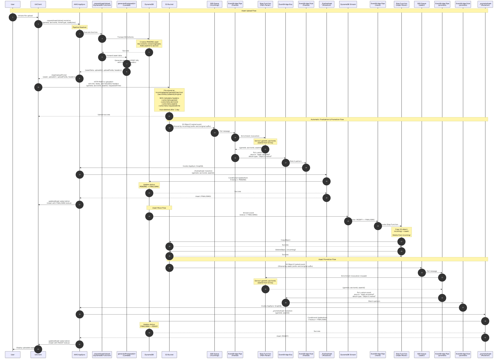

# Documentation

This directory contains documentation for the Wildsea application, including sequence diagrams for key workflows.

## Sequence Diagrams

Sequence diagrams are written in [Mermaid](https://mermaid.js.org/) format (`.mmd` files) and rendered to SVG images.

### Asset Upload Flow

Complete asset upload and finalization flow showing the journey from user initiation through S3 upload to automatic status updates.



[View Source](asset-upload-sequence.mmd) | [View SVG](asset-upload-sequence.svg)

### Asset Expiration Flow

Asset expiration flow for abandoned uploads, showing how the system automatically expires assets that were never uploaded.


[View Source](asset-expiration-sequence.mmd) | [View SVG](asset-expiration-sequence.svg)

### Generating Diagrams

To generate SVG images from Mermaid source files:

```bash
make diagrams
```

This will use Docker to run the Mermaid CLI and generate SVG files for all `.mmd` files in this directory.

### Viewing Diagrams

You can view the diagrams in several ways:

1. **GitHub** - GitHub natively renders both `.mmd` and `.svg` files in the web interface
2. **Generated SVGs** - After running `make diagrams`, view the `.svg` files in any browser or SVG viewer
3. **Mermaid Live Editor** - Copy/paste the `.mmd` content to [mermaid.live](https://mermaid.live)

### Cleaning Generated Files

To remove generated SVG files:

```bash
make clean-diagrams
```

Or as part of the full clean:

```bash
make clean
```

## Notes

- SVG files are committed to the repository for easy viewing on GitHub
- SVG format provides vector graphics that scale perfectly at any resolution
- The Mermaid CLI runs in Docker, so no local installation is required
- The Docker image used is `minlag/mermaid-cli:latest`
- Regenerate SVGs after modifying `.mmd` files using `make diagrams`
